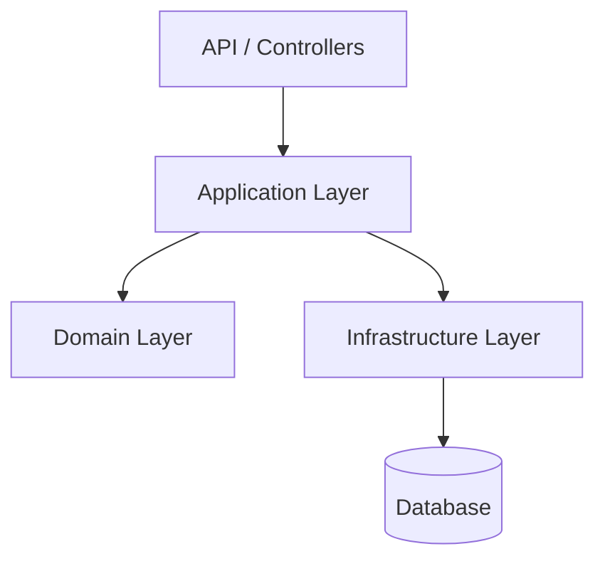

# Planta Core API

RESTful API para uma plataforma de rede social focada em plantas, utilizando Clean Architecture em ASP.NET Core.

## 📌 Tabela de conteúdo
* [Tecnologias](#-tecnologias)
* [Pré-requisitos](#-pré-requisitos)
* [Convenções](#️-convenções)
* [Arquitetura do projeto](#️-arquitetura-do-projeto)
  * [O que é Clean Architecture?](#o-que-é-clean-architecture)
  * [Como gerar um projeto Clean Architecture?](#como-gerar-um-projeto-clean-architecture)
* [Como executar o projeto](#️-como-executar-o-projeto)
* [Documentação](#-documentação)
* [Como criar uma migration](#️-como-criar-uma-migration)
* [Como executar os testes de integração](#-como-executar-os-testes-de-integração)
* [Como contribuir](#-como-contribuir)

## 🚀 Tecnologias
* [.NET](https://dotnet.microsoft.com/pt-br/)
* [ASP.NET Core](https://dotnet.microsoft.com/pt-br/apps/aspnet)
* [Swagger](https://swagger.io/)
* [Entity Framework Core](https://learn.microsoft.com/pt-br/ef/)
* [PostgreSQL](https://www.postgresql.org/)

## 📋 Pré-requisitos
* [Git](https://git-scm.com/)
* [.NET SDK 10+](https://dotnet.microsoft.com/pt-br/download/dotnet/10.0)

## ✍️ Convenções
Esse repositório adota as especificações de:
* [Branches convencionais](https://conventional-branch.github.io/pt-br/)
* [Commits convencionais](https://www.conventionalcommits.org/pt-br/v1.0.0/)

## 🏗️ Arquitetura do projeto

Esse repositório segue o padrão [Clean Architecture](https://www.geeksforgeeks.org/system-design/complete-guide-to-clean-architecture/)

### O que é Clean Architecture?

É uma **abordagem de design de software** que promove a separação de responsabilidades, favorecendo a **manutenibilidade, escalabilidade e testabilidade**.  

Seu objetivo é organizar o código em camadas distintas, cada uma com responsabilidades bem definidas, onde as **camadas internas não dependem das implementações das camadas externas, reduzindo o acoplamento com serviços externos**.



### Como gerar um projeto Clean Architecture?

#### Windows

```bash
# CONFIGURA NOME DO PROJETO
$ProjectName = "TaskTracker"

# CRIA O DIRETÓRIO RAIZ
mkdir $ProjectName
cd $ProjectName

# CRIA A SOLUÇÃO
dotnet new sln -n $ProjectName

# CRIA OS DIRETÓRIOS DOS PROJETOS
mkdir src
mkdir tests

# CRIA OS PROJETOS
dotnet new classlib -n "$ProjectName.Domain"         -o "src/$ProjectName.Domain"
dotnet new classlib -n "$ProjectName.Application"    -o "src/$ProjectName.Application"
dotnet new classlib -n "$ProjectName.Infrastructure" -o "src/$ProjectName.Infrastructure"
dotnet new webapi   -n "$ProjectName.API"            -o "src/$ProjectName.API"

# ADICIONA OS PROJETOS A SOLUÇÃO
dotnet sln add "src/$ProjectName.Domain/$ProjectName.Domain.csproj"
dotnet sln add "src/$ProjectName.Application/$ProjectName.Application.csproj"
dotnet sln add "src/$ProjectName.Infrastructure/$ProjectName.Infrastructure.csproj"
dotnet sln add "src/$ProjectName.API/$ProjectName.API.csproj"

# ADICIONA AS REFERÊNCIAS
dotnet add "src/$ProjectName.Application/$ProjectName.Application.csproj" reference "src/$ProjectName.Domain/$ProjectName.Domain.csproj"

dotnet add "src/$ProjectName.Infrastructure/$ProjectName.Infrastructure.csproj" reference "src/$ProjectName.Application/$ProjectName.Application.csproj"
dotnet add "src/$ProjectName.Infrastructure/$ProjectName.Infrastructure.csproj" reference "src/$ProjectName.Domain/$ProjectName.Domain.csproj"

dotnet add "src/$ProjectName.API/$ProjectName.API.csproj" reference "src/$ProjectName.Application/$ProjectName.Application.csproj"
dotnet add "src/$ProjectName.API/$ProjectName.API.csproj" reference "src/$ProjectName.Infrastructure/$ProjectName.Infrastructure.csproj"
```

## ⚙️ Como executar o projeto

### 1. Clone o repositório.
```bash
git clone https://github.com/LuluDiegs/PlantaCoreBackend
```

### 2. Mude para o diretório do projeto.
```bash
cd PlantaCoreBackend
```

### 3. Mude para a branch de desenvolvimento.
```bash
git checkout developer
```

### 4. Atualize os valores do arquivo `appsettings.Development.json`

> [!WARNING]  
> Alguns valores em `appsettings.Development.json` são mantidos fora do versionamento no Git por conterem informações sensíveis.  
> Certifique-se de que esses valores não sejam incluídos em commits.

### 5. Instale os pacotes.
```bash
dotnet restore
```

### 6. Compile a aplicação.
```bash
dotnet build
```

### 7. Inicie a aplicação.
```bash
dotnet run --project ./PlantaCoreAPI.API/PlantaCoreAPI.API.csproj
```

## 📝 Documentação

Esse repositório utiliza o [Swagger](https://swagger.io/) para documentação, disponivel no caminho `/index.html`

```bash
http://localhost:5123/index.html
```

## 🏷️ Como criar uma migration

### 1. Cria uma nova entidade ou altere uma existente.

```bash
.
├── PlantaCoreAPI.Domain
│   ├── Entities
│   │   ├── ActivityLog.cs
│   │   ├── Categoria.cs
│   │   ├── Comentario.cs
```

```csharp
// Exemplo: ./PlantaCoreAPI.Domain/Entities/Categoria.cs
namespace PlantaCoreAPI.Domain.Entities
{
    public class Categoria
    {
        public Guid Id { get; set; }
        public string Nome { get; set; } = null!;
        public Guid PostId { get; set; }
        public Post Post { get; set; } = null!;
    }
}
```

### 2. Crie a migration

> [!WARNING]  
> O Entity Framework Core gera migrations com base no estado atual do código e no histórico local.
>
> Se duas pessoas criarem migrations diferentes ao mesmo tempo (sem sincronizar antes), o histórico pode divergir, causando conflitos ou inconsistências na ordem das migrations.
>
> 👉 **Antes de criar ou aplicar uma migration:**
>
> * Certifique-se de que seu repositório está atualizado (`git pull`)
> * Verifique se não há migrations pendentes no time
> * Avise o time para evitar geração simultânea

#### 🪟 Windows (PowerShell / CMD)

```bash
dotnet ef migrations add <nome-para-sua-migration> ^
  --project .\PlantaCoreAPI.Infrastructure\PlantaCoreAPI.Infrastructure.csproj ^
  --startup-project .\PlantaCoreAPI.API\PlantaCoreAPI.API.csproj
```

#### 🐧 Unix (Linux / macOS)

```bash
dotnet ef migrations add <nome-para-sua-migration> \
  --project ./PlantaCoreAPI.Infrastructure/PlantaCoreAPI.Infrastructure.csproj \
  --startup-project ./PlantaCoreAPI.API/PlantaCoreAPI.API.csproj
```

### 3. Atualize o banco

#### 🪟 Windows (PowerShell / CMD)

```bash
dotnet ef database update ^
  --project .\PlantaCoreAPI.Infrastructure\PlantaCoreAPI.Infrastructure.csproj ^
  --startup-project .\PlantaCoreAPI.API\PlantaCoreAPI.API.csproj
```

#### 🐧 Unix (Linux / macOS)

```bash
dotnet ef database update \
  --project ./PlantaCoreAPI.Infrastructure/PlantaCoreAPI.Infrastructure.csproj \
  --startup-project ./PlantaCoreAPI.API/PlantaCoreAPI.API.csproj
```

## 🧪 Como executar os testes de integração

### 1. Adicionar credenciais dos usuários de teste no arquivo `TestContext.cs`

```bash
.
├── PlantaCoreAPI.IntegrationTests
│   ├── Infrastructure
│   │   ├── TestContext.cs
```

```csharp
namespace PlantaCoreAPI.IntegrationTests.Infrastructure;

public class TestContext
{
    public static string BaseUrl => Environment.GetEnvironmentVariable("TEST_API_URL") ?? "http://localhost:5123";
    public static string User1Email => Environment.GetEnvironmentVariable("TEST_USER1_EMAIL") ?? "Dados aqui"; //Usar seu usuario - NÃO SUBIR SEUS DADOS ACIDENTALMENTE
    public static string User1Senha => Environment.GetEnvironmentVariable("TEST_USER1_SENHA") ?? "Dados aqui";
    public static string User2Email => Environment.GetEnvironmentVariable("TEST_USER2_EMAIL") ?? "Dados aqui"; //Pedir meu usuario de teste
    public static string User2Senha => Environment.GetEnvironmentVariable("TEST_USER2_SENHA") ?? "Dados aqui";
}
```

> [!WARNING]  
> As credenciais dos usuários de teste são consideradas informações sensíveis.    
> Certifique-se de que esses valores não sejam incluídos em commits.

### 2. Executar os testes

```bash
dotnet test --logger "console;verbosity=normal"
```

## 🤝 Como contribuir

### 1. Clone o repositório.

```bash
git clone https://github.com/LuluDiegs/PlantaCoreBackend
```

### 2. Mude para o diretório do projeto.
```bash
cd PlantaCoreBackend
```

### 3. Mude para a branch de desenvolvimento.
```bash
git checkout developer
```

### 4. Crie uma branch nova.

```bash
git checkout -b <nome-da-minha-branch>
```

### 5. Atualize o arquivo `appsettings.Development.json`.
### 6. Adicione dependências caso necessário.
### 7. Adicione uma funcionalidade, corrija um bug ou refatore um trecho de código.
### 8. Escreva e atualize testes conforme necessário.
### 9. Atualize a documentação caso necessário.
### 10. Abra um pull request no GitHub.